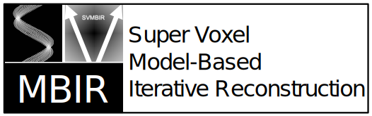

.. svmbir documentation master file, created by
   sphinx-quickstart on Fri Oct 16 16:43:57 2020.
   You can adapt this file completely to your liking, but it should at least
   contain the root `toctree` directive.

|

.. include:: ../README.rst

Indices and tables
==================

* :ref:`genindex`
* :ref:`modindex`
* :ref:`search`

.. toctree::
   :hidden:
   :maxdepth: 4
   :caption: Background

   overview
   theory
   credits

.. toctree::
   :hidden:
   :maxdepth: 4
   :caption: User Guide

   install
   examples
   api

.. toctree::
   :hidden:
   :maxdepth: 4
   :caption: Develop Guide

   pytest

